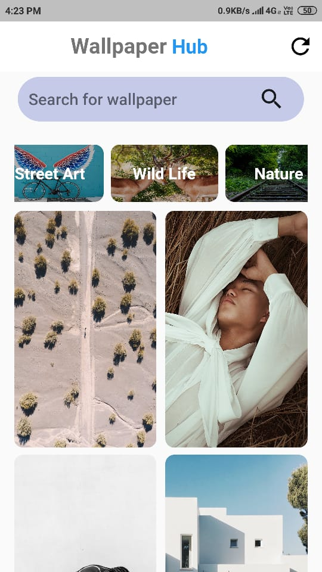
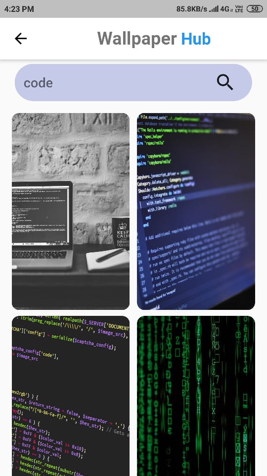
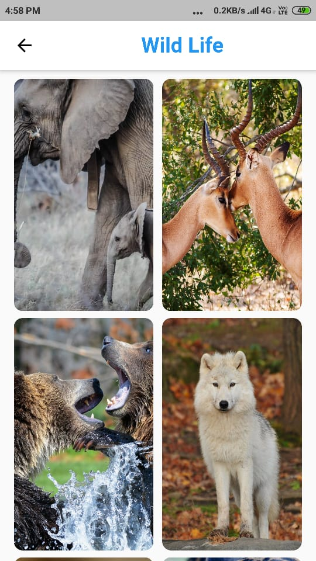
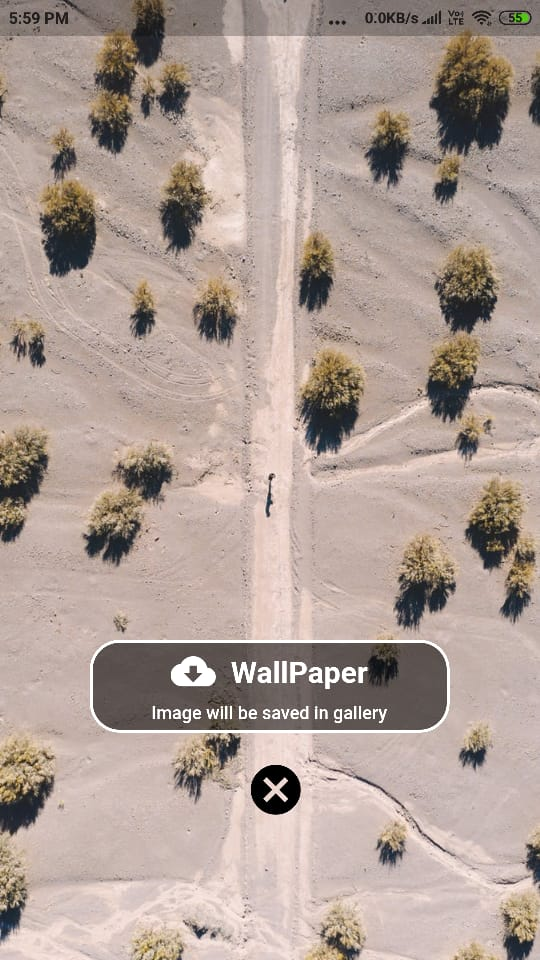

# wallpaperhub

A Flutter application.

By using this app you will collect the amazing wallpaper collections for your mobile and also you can download these amazing collection into your mobile.

## App Screens

Home Screen | Search Screen | Category Screen | WallPaper Screen
:------------------:|:--------------:|:---------------:|:------------------:
 |  |  | 
Enter the category you want and then click search icon | search for what you want | select the available category from horizontal list | click on the image to come here

###### install the app & test yourself, feel to free to comment.

# Technolgy Stack

1. [Flutter Framework](https://flutter.dev/docs) which offers tutorials,samples, guidance on mobile app development, and a full API reference.

2. [Dart Language](https://dart.dev/) to write code for flutter Apps.

## Getting Started

A few resources to get you started if this is your first Flutter project:

- [Lab: Write your first Flutter app](https://flutter.dev/docs/get-started/codelab)
- [Cookbook: Useful Flutter samples](https://flutter.dev/docs/cookbook)

##  Project Dependencies

1. [android studio](https://developer.android.com/studio) or [vs code](https://code.visualstudio.com/) .
  
2. For Collecting those amazing wallpapers i used [Pixel API](https://www.pexels.com/api/) Which is completly free, Feel free to use.
3. [dio](https://pub.dev/packages/dio) package, It is a powerful Http client for Dart, which supports Interceptors, Global configuration, FormData, Request Cancellation, File downloading, Timeout etc. {OR} [http](https://pub.dev/packages/http) This package contains a set of high-level functions and classes that make it easy to consume HTTP resources. It's platform-independent, and can be used on both the command-line and the browser.
4. [image_picker_saver]() package, using this package we can save the images to the gallery.
5. [permissions_handler](https://pub.dev/packages/permission_handler) This plugin provides a cross-platform (iOS, Android) API to request permissions and check their status. You can also open the device's app settings so users can grant a permission.On Android, you can show a rationale for requesting a permission.

